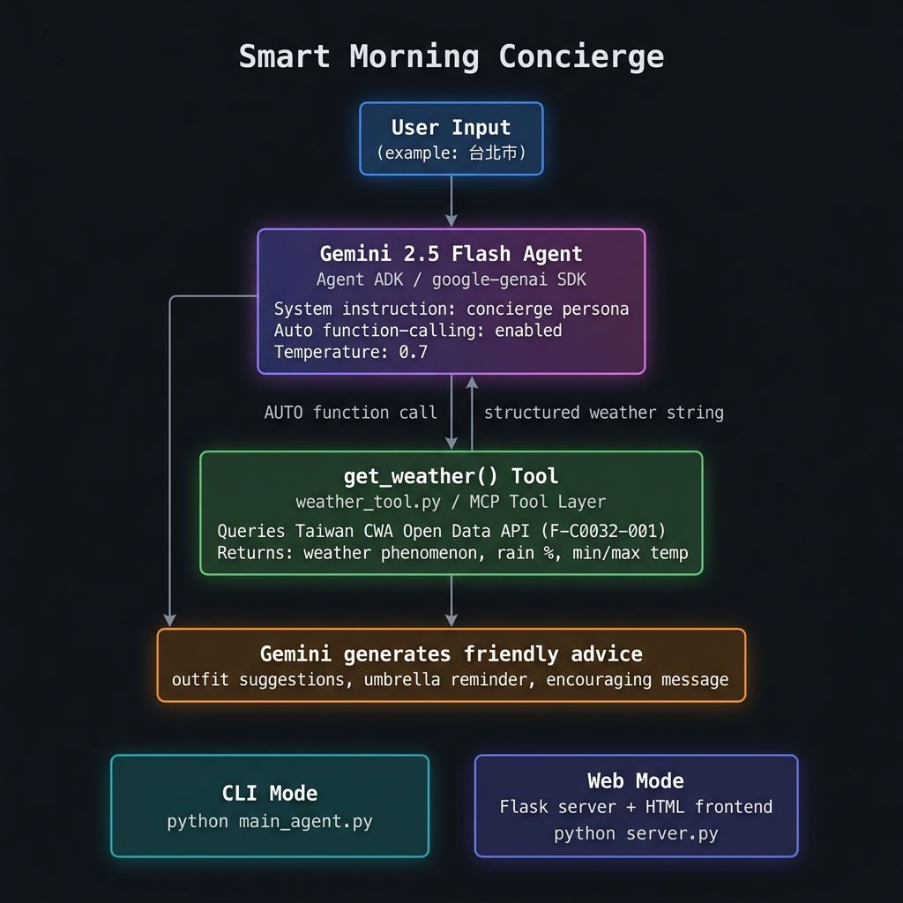

# 🌅 Smart Morning Concierge

> **An AI-powered personal concierge that tells you exactly what to wear and whether to bring an umbrella — before you leave the house.**

Built for the **Kaggle "AI Agents: Intensive Vibe Coding Capstone"** competition.

---

## 📋 Table of Contents

1. [Problem](#-problem)
2. [Solution](#-solution)
3. [Architecture](#-architecture)
4. [Setup & Installation](#-setup--installation)
5. [Running the Concierge](#-running-the-concierge)
6. [Screenshots & Demo](#-screenshots--demo)
7. [Project Structure](#-project-structure)
8. [License](#-license)

---

## 🚨 Problem

Every morning, millions of people face the same frustrating routine:

- Open a weather app, see a number (e.g. "28°C, 60% rain"), and **still not know what to wear**.
- Get caught in the rain without an umbrella because the forecast felt abstract.
- Waste mental energy making trivial decisions before the day has even started.

Raw weather data — temperature numbers and rain percentages — requires **mental translation** into actionable choices. Most weather apps give you data; none of them give you **advice**. This daily cognitive overhead is small but cumulative, and it disproportionately affects people who are already rushing in the morning.

For users in **Taiwan specifically**, the problem is compounded by the island's highly variable subtropical climate: a 20% chance of rain in Taipei can mean a sudden afternoon downpour, while a 60% chance in Kaohsiung might be a brief drizzle. Context-aware, conversational advice is far more useful than raw percentages.

---

## 💡 Solution

**Smart Morning Concierge** is an AI agent that bridges the gap between weather data and real-world decisions.

The user simply types their city name. The agent:

1. **Automatically fetches live weather data** from Taiwan's official Central Weather Administration (CWA) Open Data API — no manual lookup required.
2. **Interprets the data** using Google Gemini 2.5 Flash, a state-of-the-art large language model with a built-in concierge persona.
3. **Responds conversationally** like a knowledgeable friend, providing:
   - 👕 **Outfit suggestions** tailored to the temperature and weather conditions.
   - ☔ **Umbrella reminders** based on precipitation probability.
   - 💪 **A short encouraging message** to start the day with positivity.

The result is a zero-friction morning experience: one input, one clear answer, ready to walk out the door.

**Two interfaces are available:**
- 🖥️ **CLI mode** — fast, distraction-free terminal experience.
- 🌐 **Web mode** — a polished browser-based UI with a card layout and visual weather data.

---

## 🏗 Architecture

### High-Level Flow

```
User Input (city name, e.g. "Taipei City")
       │
       ▼
┌─────────────────────────────────────────────────────────┐
│             Gemini 2.5 Flash Agent                      │
│                 (google-genai SDK)                      │
│  • System instruction: warm, friendly concierge persona  │
│  • Auto function-calling mode: ENABLED                  │
│  • Temperature: 0.7 (balanced creativity & accuracy)    │
└──────────────────┬──────────────────────────────────────┘
                   │ AUTO function call
                   ▼
┌─────────────────────────────────────────────────────────┐
│          get_weather() Tool  (weather_tool.py)          │
│               [MCP Tool Layer concept]                  │
│  • Normalises city name aliases (Tai / Tai-pei variants) │
│  • Queries CWA Open Data API (F-C0032-001)              │
│  • Returns: weather phenomenon, rain %, min/max temp    │
└──────────────────┬──────────────────────────────────────┘
                   │ structured weather string
                   ▼
      Gemini synthesises friendly advice
       (outfit suggestion + umbrella tip
              + encouraging note)
                   │
          ┌────────┴────────┐
          ▼                 ▼
     CLI Output        Web UI (Flask)
  (main_agent.py)     (server.py +
                       templates/index.html)
```

### Architecture Diagram



### Design Decisions

| Decision | Rationale |
|---|---|
| **Agentic loop** (`run_agent`) | Implements a proper multi-turn tool-use loop so Gemini can call the weather tool, receive results, and then generate the final response — mimicking a real agent reasoning cycle. |
| **MCP Tool layer concept** | `weather_tool.py` is structured as a standalone, testable tool module following the Model Context Protocol pattern, keeping the tool separate from the agent orchestration. |
| **CWA Open Data API** | Taiwan's official government weather API provides authoritative, up-to-date 36-hour forecasts for all 22 counties and cities. Free with registration. |
| **Exponential backoff** | The agent handles Gemini API rate limits (429/503) gracefully with configurable retry logic, distinguishing between per-minute limits (retriable) and daily quota exhaustion (fail-fast with a clear message). |
| **City name normalisation** | The CWA API requires the official traditional form of city names; the tool transparently maps common abbreviations and alternate spellings (e.g. `Taipei` → `Taipei City`) so users never need to worry about encoding. |
| **Dual interface** | A Flask web server wraps the same `run_agent` function, giving both a terminal-first and browser-first experience from one codebase. |

### Key Files

| File | Role |
|---|---|
| `weather_tool.py` | MCP-style tool — wraps the CWA weather API and returns structured weather summaries |
| `main_agent.py` | Agent ADK + CLI — Gemini agent with tool binding and the agentic reasoning loop |
| `server.py` | Flask web server — exposes a REST API and serves the frontend |
| `templates/index.html` | Web frontend — a polished single-page interface built with vanilla HTML/CSS/JS |
| `.env` | Secure API key storage (never committed to version control) |

---

## ⚙️ Setup & Installation

### Prerequisites

Before you begin, make sure you have the following:

- **Python 3.10 or higher** — [Download Python](https://www.python.org/downloads/)
- **A Taiwan CWA Open Data API key** (free) — [Register at opendata.cwa.gov.tw](https://opendata.cwa.gov.tw/)
- **A Google Gemini API key** (free tier available) — [Get a key at aistudio.google.com](https://aistudio.google.com/apikey)

### Step 1 — Clone the Repository

```bash
git clone https://github.com/MerryHao/smart_morning_concierge.git
cd smart_morning_concierge
```

### Step 2 — Create a Virtual Environment (Recommended)

```bash
python3 -m venv .venv
source .venv/bin/activate      # macOS / Linux
# .venv\Scripts\activate       # Windows (Command Prompt)
# .venv\Scripts\Activate.ps1   # Windows (PowerShell)
```

### Step 3 — Install Dependencies

```bash
pip install -r requirements.txt
```

The following packages will be installed:

| Package | Version | Purpose |
|---|---|---|
| `requests` | ≥ 2.31.0 | HTTP calls to the CWA API |
| `python-dotenv` | ≥ 1.0.0 | Load API keys from `.env` file |
| `google-genai` | ≥ 1.0.0 | Google Gemini API client (Agent ADK) |
| `flask` | ≥ 3.0.0 | Web server for the browser-based UI |

### Step 4 — Configure API Keys

Copy the example environment file and fill in your API keys:

```bash
cp .env.example .env
```

Open `.env` in any text editor and replace the placeholder values:

```dotenv
CWA_API_KEY=your_cwa_api_key_here
GEMINI_API_KEY=your_gemini_api_key_here
```

> ⚠️ **Security note:** The `.env` file is listed in `.gitignore` and will **never** be committed to version control. Keep your API keys private.

---

## 🚀 Running the Concierge

### Option A — CLI Mode (Terminal)

```bash
python main_agent.py
```

You will see a welcome banner. Enter any Taiwan city or county name and press Enter:
The page header displays:

> **Smart Morning Concierge**
> *Your AI-powered outfit & weather advisor*

For the **CLI**, enter a city name when prompted:

```
📍 請輸入縣市（例如：桃園市）> 台北市

⏳ 正在查詢「台北市」的天氣並準備建議，請稍候...

───────────────────────────────────────────────────────
Hey! So for Taipei City today, you're looking at a
cloudy-to-overcast sky with temps ranging from 24°C to 29°C.
Rain probability is sitting at 60%, so I'd definitely grab
an umbrella ☔ — you'll thank yourself later.

For what to wear: a light t-shirt is fine, but toss a
thin waterproof jacket or cardigan in your bag just in case
a shower catches you off guard.

Have an awesome day out there! 💪
───────────────────────────────────────────────────────
```

Type `exit` or `quit` to quit.

**How to enter city names:**

> The CLI accepts **Traditional Chinese** city names. The web UI accepts **English** names via the quick-select chips, which automatically map to the correct Chinese names.

| Interface | Input example | Notes |
|---|---|---|
| CLI (`main_agent.py`) | `台北市`, `桃園市`, `高雄市` | Traditional Chinese required; abbreviations like `台北` also work |
| Web UI (`server.py`) | Click a city chip or type in English | Chips auto-map to correct API names |

### Option B — Web Mode (Browser UI)

```bash
python server.py
```

Then open your browser at **[http://localhost:5001](http://localhost:5001)**.

The page header displays:
- **Title:** Smart Morning Concierge
- **Subtitle:** Your AI-powered outfit & weather advisor

The web interface offers:
- Quick-select city chips (Taipei, New Taipei, Taoyuan, Taichung, Tainan, Kaohsiung) for one-click lookup.
- A weather card showing condition, temperature range, and precipitation probability.
- An AI advice panel with outfit suggestions and umbrella reminder.
- Responsive design for desktop and mobile.

### Option C — Test the Weather Tool Standalone

To verify your CWA API key is working before running the full agent:

```bash
python weather_tool.py
```

This runs a quick smoke-test against three cities (Taipei City, Taoyuan City, Kaohsiung City) and prints the raw weather data.

---

## 📸 Screenshots & Demo

### Web UI


### CLI Mode — Terminal Output

```
📍 請輸入縣市（例如：桃園市）> 桃園市

⏳ 正在查詢「桃園市」的天氣並準備建議，請稍候...

───────────────────────────────────────────────────────────
Good morning! Taoyuan City is looking mostly cloudy today,
with temperatures between 22°C and 27°C. There's a 30%
chance of rain — not super likely, but worth keeping a small
umbrella handy just in case ☂️

For your outfit: a light long-sleeve or a t-shirt with a
thin layer should keep you comfortable all day. Nothing too
heavy — it won't be cold.

Go crush it today! 🌟
───────────────────────────────────────────────────────────
```

---

## 📁 Project Structure

```
smart_morning_concierge/
├── main_agent.py        # Agent ADK + CLI — Gemini agent with agentic tool-use loop
├── weather_tool.py      # MCP-style tool — CWA Open Data API wrapper
├── server.py            # Flask web server — REST API + frontend serving
├── templates/
│   └── index.html       # Web frontend — single-page UI (HTML/CSS/JS)
├── docs/
│   ├── architecture.png # System architecture diagram
│   └── web_ui.png       # Web UI screenshot
├── requirements.txt     # Python dependencies
├── .env.example         # Template for environment variables
├── .env                 # Your API keys (⚠️ not committed to git)
└── .gitignore
```

---

## 🔑 Environment Variables Reference

| Variable | Required | Description |
|---|---|---|
| `GEMINI_API_KEY` | ✅ Yes | Google Gemini API key from [aistudio.google.com](https://aistudio.google.com/apikey) |
| `CWA_API_KEY` | ✅ Yes | Taiwan Central Weather Administration Open Data API key from [opendata.cwa.gov.tw](https://opendata.cwa.gov.tw/) |
| `PORT` | ❌ Optional | Port for the Flask web server (default: `5001`) |

---

## 📦 Dependencies

```
requests>=2.31.0
python-dotenv>=1.0.0
google-genai>=1.0.0
flask>=3.0.0
```

---

## 📄 License

This project is licensed under the **MIT License**.
